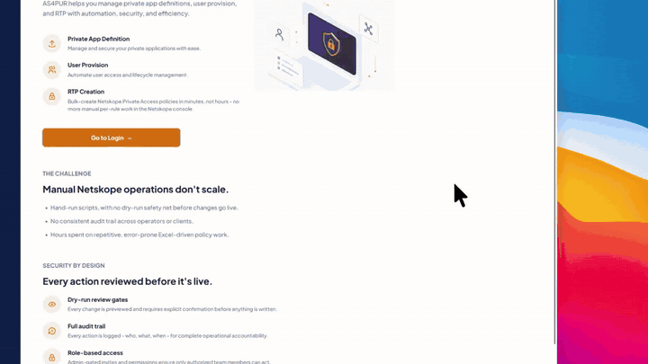
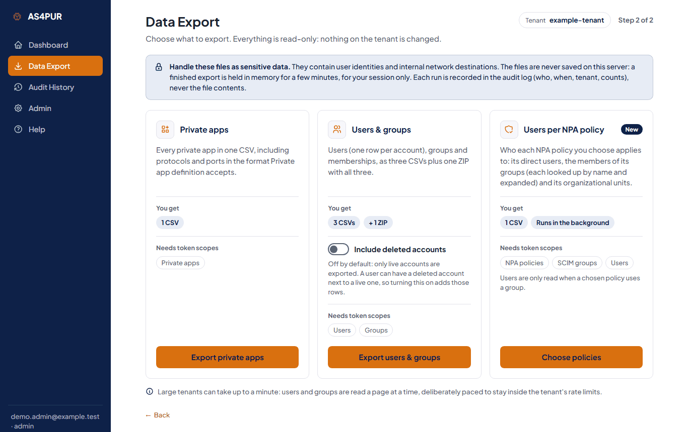
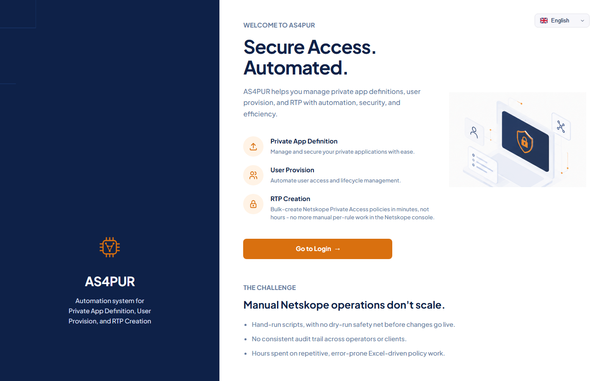
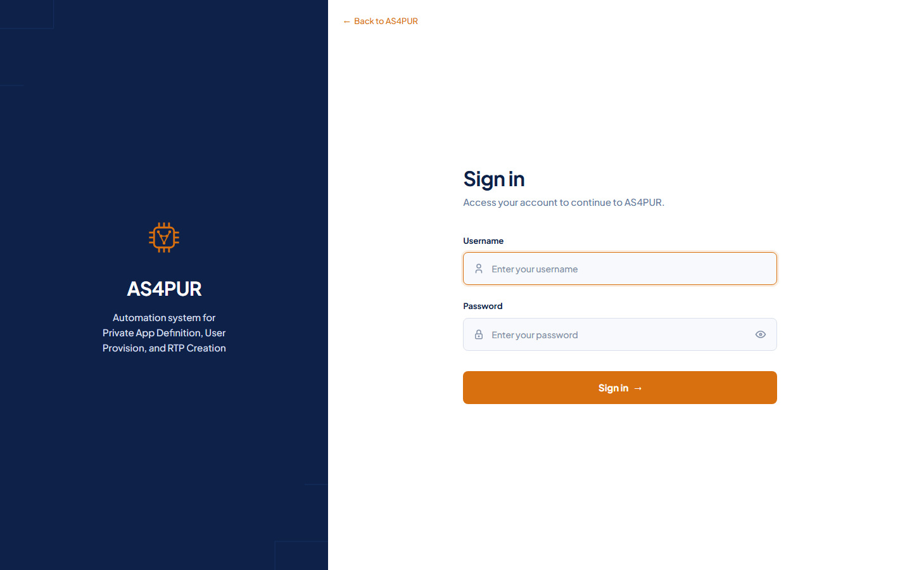
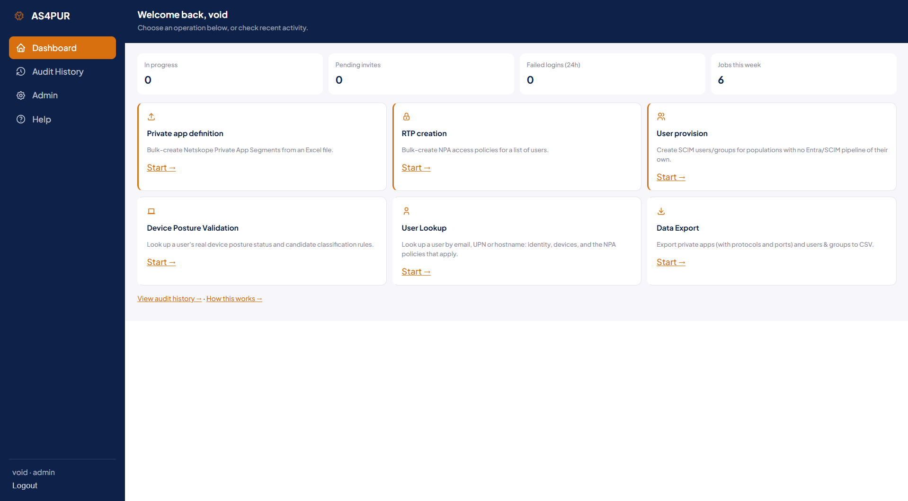

# AS4PUR

AS4PUR (Automation System for Private App Definition, User Provision, and RTP Creation) is an internal web application for engineers who administer Netskope tenants. It turns administration tasks that are otherwise done with scripts or by hand in the Netskope console - bulk-creating private apps and access policies, provisioning users, checking device posture, looking up users, exporting tenant data - into guided steps in a browser: you review what will change before anything is written, and every run is recorded in an audit history. It is a FastAPI application with server-rendered Jinja2 pages and a SQLite database.

It is built for a private network (LAN, VPN or zero-trust access) behind a TLS-terminating reverse proxy. **Do not expose it to the internet.** API tokens are typed in by the operator for each run and are never stored. Tenant names are typed in for each run too and are not kept as settings or defaults, but the name is recorded in the audit history and job records of each run.

## Demo video (4 min)



[Watch the full demo (4 min)](https://github.com/Aks2812/AS4PUR-/raw/refs/heads/main/docs/media/AS4PUR-V1_0_compressed.mp4)

## What it does

Six operations, each started from the dashboard:

- **Private app definition (Private App Import)** - upload an Excel list of apps, choose the publishers, review a dry run that skips apps whose name or destination and port already exist, then create the rest in paced batches and check afterwards that they exist in the tenant.
- **RTP creation** - resolve a list of users from an HR or directory export to their real Netskope email addresses, then create a Private Access policy rule for them (always created disabled, then re-read to confirm the stored users); users can also be added to an existing rule.
- **User provision (Local Group / User Import)** - create SCIM users, and optionally a group, from a CSV or Excel file in a tenant that has no Entra/SCIM sync of its own, with a validation step and a review before anything is written.
- **Device Posture Validation** - read-only: look up a user's devices and their posture status together with the tenant's device classification rules, or upload a device's `nsdebug.log` to see which posture checks it reports (optionally cross-referenced with the tenant's live classification rule).
- **User Lookup** - read-only: look up a user by email, UPN or hostname and see their user-management record, their devices, and which Private Access (NPA) policy rules apply to each device.
- **Data Export** - read-only, three exports to CSV: private apps (including protocols and ports); users and groups; and **users per NPA policy** - pick one or more Private Access policies and get one file listing who each applies to (its direct users, the members of its groups looked up by name and expanded, and its organizational units), with any group that cannot be resolved shown as an `UNRESOLVED` row. The last one runs in the background with a progress bar, and needs a token that can read NPA policies, SCIM groups **and** users (users are only read when a chosen policy uses a group).

Around the operations: a real login (accounts are created by an administrator, there is no self-registration), an audit history of every run with a CSV export, administrator pages for invites and user management, and a built-in Help page.

### Data Export

Read-only: nothing is written to the tenant. After entering the tenant and token, the Data Export page offers three exports: **Private apps**, **Users and groups**, and **Users per NPA policy**. The page, and every page of the Users per NPA policy flow, shows the tenant of the current run in a "Tenant" pill.



*The Data Export page, from a throwaway instance with a made-up tenant name; no tenant was connected.*

- **Private apps** - one CSV of every private app, including protocols and ports written in the format Private app definition accepts. Needs a token that can read private apps.
- **Users and groups** - users (one row per account), groups and memberships as three CSVs plus one ZIP with all three. Deleted accounts are left out unless "Include deleted accounts" is switched on. Needs a token that can read users and groups.
- **Users per NPA policy** - described next.

**Users per NPA policy** answers "who does this policy apply to?". You load the tenant's Private Access policies, pick one or more from a searchable list (name, id, action, an enabled/disabled badge, and how many direct users, groups and organizational units each names), check a preview of what the run will do, and start it. It runs in the background with a progress bar, then offers a CSV download and shows any warnings. Each run leaves one entry in the audit history (who, when, the tenant name, the policy and row counts, the status; never the token, a user, a group or a policy name), and each download adds an audit-log row (who, when, tenant, row count).

The token needs three read permissions, and a missing one stops the run with a message and no file:

- **NPA policies** - to read the policy list.
- **SCIM groups** - to look each group up by name (`displayName`) and read its members.
- **Users** - to turn the SCIM member ids into email addresses. This is only read when a chosen policy uses a group.

CSV columns, in this order (UTF-8 with a BOM; the file is named `as4pur-npa-policy-users-YYYYMMDD-HHMMSSZ.csv` with the UTC time of the run, and the tenant name is never part of the file name):

| Column | Meaning |
|---|---|
| `policy_name`, `policy_id` | The policy. |
| `action` | As the policy states it: `allow`, `block`, or another value such as `periodic_reauth`. |
| `enabled` | `true` if the policy's `enabled` field is `"1"`, `false` if it is `"0"`. Anything else (field missing, empty, another type or value) is `unknown`; it is never guessed. |
| `user` | The user's email address. Empty on organizational-unit rows and on `UNRESOLVED` and `EMPTY` rows. |
| `via` | `direct` (named in the policy), `group` (a member of a group the policy names), `organization_unit`, or `all_users`. |
| `group_name` | The group, or the organizational unit; empty on direct rows. |
| `status` | `OK`, `UNRESOLVED`, `EMPTY` or `ALL_USERS` (see below). |
| `reason` | Empty unless `status` is `UNRESOLVED` or `EMPTY`, where it says why. |

- **`UNRESOLVED`** - something the policy names could not be turned into users: a group not found by name, a name shared by two groups, members that SCIM did not return, a member who is missing from, or matches several users in, the tenant's user list, or an entry that could not be read. The row has an empty `user` and the explanation in `reason`, the run page shows a warning, and the rest of the file is still produced. Nothing is dropped and nothing is guessed.
- **`EMPTY`** - the group was found and read, and it has no members: membership *was* determined and is zero. One row with `via` = `group`, `group_name` set, an empty `user` and `reason` = `group has no members`. It is not the same as `UNRESOLVED` (membership could not be determined) and it does not raise a warning by itself; the run page counts it separately.
- **`ALL_USERS`** - the policy names no users, groups or organizational units (and has no unreadable entries), so it does not restrict by user. One row, `user` = `ALL_USERS (no user/group restriction)`, `via` = `all_users`, `reason` empty.
- **`enabled`** is informational: a disabled policy is still exported, so filter on the column if you only want enabled ones.
- Nothing is merged across `via`: a user reachable directly and through two groups has three rows. A group that exists but has no members has one `EMPTY` row (see above), so it is never silently dropped.
- A cell that starts with `=`, `+`, `-`, `@`, a tab or a carriage return gets a leading `'`, so a spreadsheet does not read it as a formula.
- A failed run stores and shows only a fixed message built from known parts: the phase (`loading policies`, `resolving users`, `expanding groups`, `building the file`), a short category (auth, scope, rate limit, server error, timeout, network, tls, rejected, unexpected reply, truncation/mismatch, limit, internal error) and the HTTP status code. Netskope's own error text is never stored, logged or shown, because it can echo a group name or mention an unrelated user.
- Every list is read to the end and, wherever the tenant reports a total, checked against it (the policy list may come without one; the page says so); a short or inconsistent answer fails the run with an error instead of producing a partial file. Hard ceilings apply (2,000 API calls and 200,000 rows per export), and rate-limit (HTTP 429) and server-error (5xx) answers are retried, waiting as long as Netskope asks or a short back-off.
- The file lists email addresses, so handle it as sensitive data. It is held in process memory only, for 10 minutes, for the session that ran it, and is gone after a restart or logout. Until role enforcement is added, any signed-in account can run this export.
- How a policy's group entries map to SCIM groups (by `displayName`) follows Netskope's documentation and mocked tests, and has been checked once against a real production tenant, for a group-based policy: the number of users exported matched the count in the Netskope console. It has not been confirmed for every kind of group or for every tenant, so compare the first export on a tenant with the console. A group that does not resolve shows up as `UNRESOLVED`.

## Screenshots

No tenant name, API token or tenant data appears in these screenshots. The Data Export page is shown in the "Data Export" section above.



*The public landing page, shown to visitors who are not signed in.*



*The sign-in page.*



*The dashboard: status counters and one card for each operation.*

## Disclaimer

AS4PUR is an unofficial tool. It is not affiliated with, endorsed by or supported by Netskope. Netskope is a trademark of its owner.

**Verification legend.** Commands in this file are tagged on their first line:

- `[verified]` - the same step was run in a fresh clone of this repository, on Windows, with Python 3.11 and with Python 3.12 (the Windows equivalent of each path, for example `.venv\Scripts\python.exe` for `.venv/bin/python`).
- `[not executed]` - written from the repository's deploy files and standard tooling, and not run one by one for this document. The Docker deployment is running on the maintainers' on-prem server; "Installation with Docker" says exactly what that does and does not cover.

## Installation

There are two ways to install AS4PUR:

- **With Docker, one command** - described right below. Docker runs the app and an nginx proxy with HTTPS for you; no Python, venv, systemd unit or nginx install on the host.
- **Manually, with Python, systemd and nginx** - the sections from "Requirements" to "Example systemd unit" further down.

Everything else in this README (configuration, single worker, backups, security) applies to both.

### Installation with Docker

**What you get:** two containers started by `docker-compose.yml`:

| Container | What it does |
|---|---|
| `as4pur-app` | The application: built from `Dockerfile` (Python 3.12, exact pins from `requirements.txt`), runs as a non-root user, applies database migrations on every start, then runs **one** uvicorn process (`WEB_CONCURRENCY=1` is pinned). Port 8000 is only reachable from the nginx container, never from the host. |
| `as4pur-nginx` | TLS (HTTPS) on port 443, redirect from port 80, with the same TLS 1.3 profile, rate limits and 55 MiB upload limit as `deploy/nginx_as4pur.conf` (`deploy/docker/nginx.conf`). |

The database and temporary uploads live in the Docker volume `as4pur-data`, so they survive rebuilds, restarts and updates.

**Requirements:** a Linux host with Docker Engine and the Docker Compose plugin, outbound HTTPS to `<tenant>.goskope.com`, and ports 80/443 free (or other ports, see below). Python is not needed on the host.

```
# [not executed]  Ubuntu: install Docker Engine + Compose plugin (Docker's official convenience script)
curl -fsSL https://get.docker.com | sudo sh
sudo usermod -aG docker $USER      # then log out and back in, or run deploy.sh with sudo
```

**Install and start (one command):**

```
# [not executed]
git clone <REPO_URL> as4pur
cd as4pur
./deploy.sh
```

`deploy.sh` does, in order:

1. Checks that Docker and Compose are installed and the Docker daemon is reachable.
2. Creates `.env` from `.env.example` if it does not exist yet (`chmod 600`). It warns if `AS4PUR_INVITE_ALLOWED_DOMAINS` is still empty or the `example.com` placeholder.
3. Creates a self-signed TLS certificate in `deploy/docker/certs/` if none is there (825 days, for the host name, `localhost` and `127.0.0.1`). It uses `openssl` on the host, or a throwaway container if `openssl` is missing.
4. Builds the image and starts both containers (`docker compose up -d --build`).
5. Waits until the app reports healthy (a request to `/login` answers 200), and prints the last log lines if it does not.
6. If no account exists yet, asks for an admin username and runs `scripts/create_user.py` (password prompt, 12+ characters). Without a terminal it prints the command instead.
7. Prints the URL, for example `https://<your-host>`.

Run it again at any time: an existing `.env` and certificate are never overwritten.

**Configuration:** edit `.env` (same `AS4PUR_` variables as in "Configuration" below), then run `./deploy.sh` again. In Docker these values are fixed by `docker-compose.yml` and cannot be changed from `.env`: `AS4PUR_DATABASE_PATH` (`/app/data/as4pur.db`), `AS4PUR_UPLOAD_TEMP_DIR` (`/app/data/uploads_tmp`) and `WEB_CONCURRENCY` (`1`). Keep `AS4PUR_SECURE_COOKIES=true`: nginx serves HTTPS. Extra settings that only the Docker setup reads from `.env` (or from the shell):

| Variable | Meaning | Default |
|---|---|---|
| `HTTPS_PORT` | Host port for HTTPS. | `443` |
| `HTTP_PORT` | Host port that redirects to HTTPS. | `80` |
| `CERT_HOST` | Host name written into the self-signed certificate (only used when the certificate is created). | the host's name |

**Your own certificate (internal CA):** put `fullchain.pem` and `privkey.pem` into `deploy/docker/certs/` (replace the self-signed ones), then `docker compose restart nginx`. The folder is git-ignored.

**Daily operation:**

```
# [not executed]
./deploy.sh --logs                 # follow the app logs (Ctrl+C to stop following)
./deploy.sh --stop                 # stop both containers; data stays in the as4pur-data volume
docker compose ps                  # status and health
docker compose exec app python scripts/create_user.py <username> admin    # create or reset an account
```

**Update:**

```
# [not executed]
git pull --ff-only
./deploy.sh
```

Migrations run automatically when the new container starts. As in "Upgrade" below: take a backup first and update when no job is running, because a restart drops everything held in memory (running jobs, entered tokens, unfinished wizards).

**Backup** (SQLite online backup inside the container, then copied out):

```
# [not executed]
docker compose exec app python -c "import sqlite3; s = sqlite3.connect('/app/data/as4pur.db'); d = sqlite3.connect('/app/data/backup.db'); s.backup(d); d.close()"
docker compose cp app:/app/data/backup.db ./as4pur-backup.db
docker compose exec app rm /app/data/backup.db
```

**Notes:**

- One app container only. Never scale it (`docker compose up --scale app=2`) or add `--workers`: see "Run" for why AS4PUR must be a single process.
- `docker compose down -v` **deletes the `as4pur-data` volume**, meaning every account, the audit log and the job history. Plain `docker compose down` (or `./deploy.sh --stop`) keeps it.
- Private network only, exactly as for the manual install: do not open ports 80/443 to the internet. Use the host firewall from `deploy/README_DEPLOY.md` (section 8) here too.
- Behind a load balancer that terminates TLS itself, the nginx container is still in the path; see "B. Cloud VM" for the forwarded-header and timeout points.
- **Status:** this Docker setup (the `as4pur-app` and `as4pur-nginx` containers with TLS, started with `./deploy.sh`) is running on the maintainers' on-prem server, and updates there are applied with `git pull` and `./deploy.sh`. That is the only environment it is known to run in. Not verified: other hosts, specific Linux distributions or versions, cloud platforms, a load balancer in front, and more than one app container (which must not be used, see above). The individual command blocks in this section keep the `[not executed]` tag: they were not run one by one for this document.

## Requirements

- **OS:** Ubuntu Server 22.04 LTS or newer is the target. Any Linux with systemd and nginx should work, but only Ubuntu is described here.
- **Python:** 3.11 or 3.12 (Ubuntu 24.04's default `python3` is 3.12). **Not 3.10:** `requirements.txt` pins `websockets==17.1`, which needs Python 3.11 or newer and has no wheel for 3.10, so `pip install -r requirements.txt` fails there; that includes the default `python3` of Ubuntu 22.04, where you would first need a newer Python alongside the system one (not covered here). Evidence for 3.11 and 3.12: `pip download --only-binary=:all:` for Linux x86_64 (manylinux, up to glibc 2.35) found a ready-made wheel for every pinned package, including `uvloop`, `greenlet`, `pydantic-core` and `argon2-cffi-bindings`, so no compiler is needed; and the application was installed from the exact pins, migrated and run from a fresh clone on both (on Windows). **Not checked:** Python 3.13 or newer, and any CPU other than x86_64 (for example ARM cloud instances).
- **System packages (Ubuntu):** `git`, `python3-venv`, `python3-pip`, and `nginx` for the reverse proxy.
- **Network:** outbound HTTPS to the Netskope API host of each tenant you operate (`<tenant>.goskope.com`).
- **Playwright:** not needed to run AS4PUR. It is only used by browser regression tests, and the test suite is not part of this repository. If you run such tests elsewhere: `pip install -r requirements-dev.txt`, then `python -m playwright install chromium`, plus the browser's system libraries on Ubuntu (`sudo python -m playwright install-deps chromium`). `requirements-dev.txt` holds test-only packages; the server installs `requirements.txt` only.

```
# [not executed]
sudo apt update
sudo apt install -y git python3-venv python3-pip nginx
```

## Install

Steps for a quick start on any machine. The hosting sections below use the same steps under a dedicated service user.

```
# [verified]  (Windows form: py -3.12 -m venv .venv, then .venv\Scripts\python.exe ...)
git clone <REPO_URL> as4pur
cd as4pur
python3 -m venv .venv
.venv/bin/python -m pip install -r requirements.txt
cp .env.example .env
```

`requirements.txt` holds exact pins (`==`) for every runtime package, direct and indirect, equal to the versions the test suite ran against (Python 3.12), so an install is the tested one. Three entries could not come from that environment because it is Windows on 3.12: `uvloop` (Linux only), and `exceptiongroup` and `tomli` (Python 3.10 only, so unused on the supported versions); they are the newest versions pip resolved when the pins were set. Test-only packages are in `requirements-dev.txt`. To update a pin: change it, run the tests, and re-check that a wheel exists for each supported Python.

## Configuration

Settings are read from `.env` (copy `.env.example`) or from real environment variables, all with the `AS4PUR_` prefix. `.env` is read once at startup, so a change needs a restart. **None of these settings is a secret.** The app has no signing key, no pepper and no seeded account: session, CSRF and invite tokens are generated at runtime and stored server-side (hashed). Keep `.env` out of git anyway (it is ignored) and readable only by the service user.

| Variable | Meaning | Default | Required / secret |
|---|---|---|---|
| `AS4PUR_DATABASE_PATH` | SQLite database file. The parent directory is created if missing. Use an absolute path on persistent storage in production. | `./data/as4pur.db` | optional, not secret |
| `AS4PUR_SESSION_LIFETIME_MINUTES` | Idle session timeout; every request extends it. | `30` | optional, not secret |
| `AS4PUR_SECURE_COOKIES` | Mark the session and CSRF cookies `Secure`. Keep `true` in every real deployment. Set `false` only to test over plain `http://`; a browser then refuses `Secure` cookies and login appears not to stick. This is a setting, not derived from the request scheme, so it works behind a TLS-terminating proxy or load balancer. | `true` | optional, not secret |
| `AS4PUR_LOGIN_RATE_LIMIT_ATTEMPTS` | Failed logins allowed per window before a lock-out. In-memory; resets on restart. | `5` | optional, not secret |
| `AS4PUR_LOGIN_RATE_LIMIT_WINDOW_MINUTES` | Window for the limit above. | `15` | optional, not secret |
| `AS4PUR_UPLOAD_MAX_BYTES` | Size limit for Excel/CSV uploads. | `10485760` (10 MiB) | optional, not secret |
| `AS4PUR_NSDEBUG_UPLOAD_MAX_BYTES` | Size limit for nsdebug.log uploads (Device Posture Validation). Keep nginx `client_max_body_size` above it. | `52428800` (50 MiB) | optional, not secret |
| `AS4PUR_UPLOAD_TEMP_DIR` | Where uploads are held while they are processed; files are deleted afterwards. | `./data/uploads_tmp` | optional, not secret |
| `AS4PUR_DATA_EXPORT_PAGE_SIZE` | Rows per users/groups request in Data Export, 1-200. Values outside the range stop the app from starting. | `200` | optional, not secret |
| `AS4PUR_INVITE_ALLOWED_DOMAINS` | Email domains an admin may invite from `/admin`: comma-separated, case-insensitive, for example `example.com,example.org`. **Empty or missing refuses every invite** (the admin page says so) until it is set. | empty | **required to invite anyone**, not secret |
| `AS4PUR_ENABLE_API_DOCS` | Set to `1` to serve FastAPI's interactive docs (`/docs`, `/redoc`) and `/openapi.json`. Off by default: those routes do not exist (404), because they list every route of the app and need no login. Development only. | `0` | optional, not secret |
| `AS4PUR_APP_NAME` | Application title. Not listed in `.env.example`. | `AS4PUR` | optional, not secret |

Relative paths resolve against the directory the process is started from.

Process-level settings (not `AS4PUR_` variables), handled by uvicorn:

- **Bind address and port:** `--host` / `--port` on the command line, or the `UVICORN_HOST` / `UVICORN_PORT` environment variables. Default `127.0.0.1:8000`. `[verified]` for both forms.
- **Trusted proxy:** by default uvicorn trusts `X-Forwarded-For` / `X-Forwarded-Proto` only from `127.0.0.1`. If a proxy or load balancer on another address sits in front, pass `--forwarded-allow-ips <address>` or set `FORWARDED_ALLOW_IPS`. Without it the app sees the proxy's address as the client (login rate limiting and the audit log then use the wrong address) and invite links get the wrong scheme. `[not executed]` (documented in `uvicorn --help`).
- **Log level and destination:** `--log-level`. The app writes to stdout/stderr (the systemd journal under systemd) and has no log file of its own.
- **Worker count:** see "Run" below. `WEB_CONCURRENCY` must be unset or `1`; the app refuses to start otherwise.

## Database

```
# [verified]  from an empty database: applies 4 migrations, ends at head
.venv/bin/python -m alembic upgrade head
```

Run this **before the first start**. If the app is started first on an empty database it creates the tables itself without recording migration history, and a later `alembic upgrade head` then fails with "table already exists" (observed in the fresh-clone check). `alembic upgrade` takes the database path from the same settings as the app, so run it from the repository root with the same `.env`.

After pulling a release, run `alembic upgrade head` again (see "Upgrade").

## First login

There are no default accounts. Create the first administrator on the host:

```
# [verified]  with the password prompt stubbed (the real script asks twice, hidden input, 12+ characters)
.venv/bin/python scripts/create_user.py <username> admin
```

Then open `https://<your-host>/login`. An administrator invites everyone else from `/admin` (invite links are single-use). Invites are only accepted for the email domains listed in `AS4PUR_INVITE_ALLOWED_DOMAINS`; set it in `.env` and restart the app before inviting anyone.

If login seems not to stick when you test over plain `http://` at a hostname or LAN address, set `AS4PUR_SECURE_COOKIES=false` in `.env`, restart, and set it back to `true` for real use. (`http://127.0.0.1` is exempt in modern browsers, so it will not show the problem.)

## Run

```
# [verified]  (Windows: .venv\Scripts\uvicorn.exe)
.venv/bin/uvicorn app.main:app --host 127.0.0.1 --port 8000
```

**AS4PUR must run with exactly one worker process per instance.** Operator tokens, in-progress wizards, running background jobs, finished Data Export files (10 minutes, memory only) and the login limiter all live in the memory of that one process; a second worker would not see them (a Data Export download could answer "gone" from the worker that did not build the file, and a job could not be polled). So: do not add `--workers`, do not use a multi-worker Gunicorn, do not use `--reload` outside development, and leave `WEB_CONCURRENCY`, `UVICORN_WORKERS` and every similar setting unset.

How the single worker is enforced, and what is not:

- The example unit below sets `Environment=WEB_CONCURRENCY=1`, so a value inherited from the host cannot start extra workers. I could not confirm from the systemd documentation how it orders `Environment=` against a line in the `EnvironmentFile=`, so never put `WEB_CONCURRENCY` in `.env` either.
- The app refuses to start when `WEB_CONCURRENCY` is anything but `1`. It does **not** look at `--workers N` on the command line, `UVICORN_WORKERS`, `gunicorn -w N`, or several separate instances behind a proxy: before this check existed `WEB_CONCURRENCY=2` started two server processes, and `UVICORN_WORKERS=2` and `--workers 2` still do (all observed with uvicorn 0.54 in a fresh clone).
- **A refusing worker does not stop the service.** With `WEB_CONCURRENCY=2` uvicorn's supervisor respawns each worker the moment it refuses, so the main process keeps running, serves nothing, and repeats the message. `systemctl status as4pur` can therefore show `active (running)` while every request fails. In the journal it looks like the same two lines over and over:

```
# [not executed]  the wording below was observed in the fresh-clone check on Windows, not under systemd
journalctl -u as4pur -n 50 --no-pager
#   AS4PUR refuses to start: WEB_CONCURRENCY is set to '2', but AS4PUR must run as a single process. ...
#   INFO:     Child process [<pid>] died
```

  If you see that, remove `WEB_CONCURRENCY` from the unit and from `.env`, then `sudo systemctl restart as4pur`.

The app has no health or liveness endpoint (`/health` and `/healthz` return 404). Use a request to `/login` (HTTP 200) if a monitor needs a URL.

## Where state lives

| What | Where | Notes |
|---|---|---|
| Users, sessions, audit log, jobs | SQLite file (`AS4PUR_DATABASE_PATH`) plus `-wal` and `-shm` files while running | The only data that must persist and be backed up. |
| Uploads in progress | `AS4PUR_UPLOAD_TEMP_DIR` | Temporary; deleted after each run. |
| Netskope tokens, Data Export files | Process memory only | Lost on restart, logout or expiry. Never on disk. |
| Tenant names | Typed for each run and held in memory while a wizard is open; also recorded in the SQLite audit history and job records (`jobs.tenant`, `audit_log.tenant`) | Never a setting or a default. The name is the only tenant detail kept as such; the results of a run (per-item outcomes) are kept in its job record. |
| Browser | Cookies only (`as4pur_session`, login/registration CSRF cookies, a language preference cookie) | No local storage. |

Both default paths are under `./data/`, inside the checkout but ignored by git. For a server, either keep `data/` on a persistent disk or set the two paths to a persistent location outside the code tree. Whatever you choose, the service must be able to write there (see `ReadWritePaths` in the systemd unit).

## Hosting

### A. On-premises VM (systemd + nginx)

Layout: code in `/opt/as4pur`, state in `/opt/as4pur/data`, service user `as4pur`, uvicorn on `127.0.0.1:8000`, nginx on 443. `deploy/README_DEPLOY.md` has the same steps plus host hardening (firewall, log rotation, patching).

```
# [not executed]
sudo useradd --system --home /opt/as4pur --shell /usr/sbin/nologin as4pur
sudo mkdir -p /opt/as4pur && sudo chown as4pur:as4pur /opt/as4pur
sudo -u as4pur git clone <REPO_URL> /opt/as4pur          # the directory must be empty
cd /opt/as4pur
sudo -u as4pur mkdir -p data
sudo -u as4pur python3 -m venv .venv
sudo -u as4pur .venv/bin/python -m pip install -r requirements.txt
sudo -u as4pur cp .env.example .env && sudo chmod 600 .env
sudo -u as4pur .venv/bin/python -m alembic upgrade head
sudo -u as4pur .venv/bin/python scripts/create_user.py <username> admin
```

A private repository needs read access for the `as4pur` user (for example a read-only deploy key). Do not put a token in a remote URL that is saved on the server.

TLS certificate (self-signed or from an internal CA), the systemd unit and nginx:

```
# [not executed]
sudo mkdir -p /etc/ssl/as4pur
sudo openssl req -x509 -nodes -newkey rsa:2048 -keyout /etc/ssl/as4pur/privkey.pem -out /etc/ssl/as4pur/fullchain.pem -days 825 -subj "/CN=<your-hostname>"

sudo cp deploy/as4pur.service /etc/systemd/system/
sudo systemctl daemon-reload
sudo systemctl enable --now as4pur

sudo cp deploy/nginx_as4pur.conf /etc/nginx/sites-available/as4pur
sudo ln -s /etc/nginx/sites-available/as4pur /etc/nginx/sites-enabled/
sudo nginx -t && sudo systemctl reload nginx
```

Edit `deploy/nginx_as4pur.conf` first: `server_name as4pur.internal` appears twice and is a placeholder for your hostname; the certificate paths and the `limit_req` rates are its other site-specific values. The provided configuration allows TLS 1.3 only.

### B. Cloud VM

Use the same layout and the same steps as A on an Ubuntu VM, with these differences:

- **Persistent disk for state.** Put `/opt/as4pur/data` (or the paths you set in `.env`) on a disk that outlives the instance. On an ephemeral instance disk, replacing the VM loses every user account, the audit log and the job history. Keep the systemd `ReadWritePaths` line equal to the directory you use.
- **Private access only.** Place the VM in a private subnet, or behind a VPN or zero-trust gateway. Do not give it a public address with port 443 open. The application is designed for LAN use and must not face the internet.
- **TLS.** Either terminate at nginx on the VM exactly as in A, or terminate at a load balancer. With a load balancer: (1) bind uvicorn to the VM's private address instead of `127.0.0.1` and keep it unreachable from anywhere else; (2) pass `--forwarded-allow-ips <load balancer address or subnet>` so the real client address and `https` scheme are used; (3) keep `AS4PUR_SECURE_COOKIES=true`; (4) reproduce nginx's request limits on the balancer (55 MiB request body, and the timeout in the next section). The provided nginx file hard-codes `X-Forwarded-Proto https`, which is only correct when TLS ends at that nginx.
- **Security groups / firewall:** allow 443 only from the networks that need access.
- Nothing in this repository was tested on a cloud provider.

## nginx notes

- `client_max_body_size 55m` is already set in `deploy/nginx_as4pur.conf`. It must stay above `AS4PUR_NSDEBUG_UPLOAD_MAX_BYTES` (50 MiB), otherwise nginx answers large uploads with its own bare 413 page. If you raise the app limit, raise this too, then reload nginx.
- **`proxy_read_timeout` is not set**, so nginx's default of 60 seconds applies. Data Export's private-apps and users-and-groups exports run a whole export in one request (users per NPA policy runs as a background job and is not bound by this timeout). Measured against a small test tenant, each page of 200 users costs about 1.7 seconds (the API call plus the 0.3 second pause the client keeps between calls), so about 30 pages fit in 60 seconds. That figure comes from one small tenant and is an estimate for larger ones. A tenant with several thousand users can exceed that; nginx then returns a 504 even though the export may finish on the server, and the result is not shown. Add `proxy_read_timeout 300s;` to `location /` for larger tenants (and raise the idle timeout on any load balancer). `[not executed]`
- One application worker only, as above.
- FastAPI's interactive documentation (`/docs`, `/redoc`) and `/openapi.json` are **disabled by default** (the routes do not exist, so they answer 404; checked in the fresh clone). Turn them on only on a development machine with `AS4PUR_ENABLE_API_DOCS=1`. If you want a second layer anyway, block them at the proxy: `location ~ ^/(docs|redoc|openapi\.json)$ { return 404; }` `[not executed]`.

## Example systemd unit

An example derived from the real start command above. It has not been verified on a target server. The full version with additional sandboxing is `deploy/as4pur.service`; its own comments flag which of those lines are still unverified, and to try commenting out `RestrictAddressFamilies` / `SystemCallFilter` first if the service fails to start.

```
# [not executed]  /etc/systemd/system/as4pur.service
[Unit]
Description=AS4PUR
After=network.target

[Service]
Type=simple
User=as4pur
Group=as4pur
WorkingDirectory=/opt/as4pur
EnvironmentFile=/opt/as4pur/.env
# One process only: pin the worker count and never add --workers
Environment=WEB_CONCURRENCY=1
ExecStart=/opt/as4pur/.venv/bin/uvicorn app.main:app --host 127.0.0.1 --port 8000
Restart=on-failure
RestartSec=5
NoNewPrivileges=true
ProtectSystem=strict
ReadWritePaths=/opt/as4pur/data
ProtectHome=true
PrivateTmp=true
MemoryMax=512M

[Install]
WantedBy=multi-user.target
```

## Upgrade

```
# [not executed]
cd /opt/as4pur
sudo -u as4pur git pull --ff-only
sudo -u as4pur .venv/bin/python -m pip install -r requirements.txt
sudo -u as4pur .venv/bin/python -m alembic upgrade head
sudo systemctl restart as4pur
```

Take a database backup first (next section). A restart drops everything held in memory: running background jobs, entered tokens and unfinished wizards, and any finished export that has not been downloaded. Restart when no job is running. After the restart, `journalctl -u as4pur` showing "Database schema may be out of date" means a migration was skipped.

## SQLite backup

The database runs in WAL mode, so a plain file copy of `as4pur.db` from a running instance can miss recent commits. Use SQLite's online backup, or stop the service and copy `as4pur.db` together with its `-wal` and `-shm` files:

```
# [not executed]   (needs the sqlite3 package: sudo apt install sqlite3)
sudo -u as4pur sqlite3 /opt/as4pur/data/as4pur.db ".backup '/path/to/backup/as4pur-backup.db'"
```

A backup contains user accounts (password hashes), the audit log and job history. Protect it like a credential store. It contains no Netskope tokens.

## Security notes

- **Network:** private network only, reached through VPN or zero-trust access, TLS always. The app still requires a real login and sends strict security headers (CSP without inline scripts, HSTS, frame denial) on every response. HSTS is sent unconditionally, so use the app over HTTPS only.
- **Accounts:** argon2 password hashes, server-side sessions with an idle timeout, CSRF protection on every form, login rate limiting (in the app and in the provided nginx file). There is no self-registration and no default account.
- **Secrets:** the app needs none. `.env` holds settings only; it is git-ignored and should be `chmod 600`. Never commit it.
- **Netskope tokens:** entered per operation, kept only in process memory, dropped at logout or expiry, and never written to the database, logs or audit records. Data Export files are built in memory and are not written to disk.
- **Uploads:** type and size limits are enforced before parsing; temporary files are deleted after processing.

## Security policy

To report a vulnerability, read [SECURITY.md](SECURITY.md). Please use GitHub private vulnerability reporting, not a public issue, and leave real tenant names, tokens and user data out of the report.

## Known limitations

Facts about the current version, each checked against the code:

- **One worker process only.** Netskope tokens, unfinished wizards, running background jobs, finished Data Export files and the login rate limiter live in the memory of that one process. The app refuses to start when `WEB_CONCURRENCY` is anything but `1`, but it cannot see `--workers N`, `UVICORN_WORKERS` or several instances (see "Run").
- **State in process memory is lost on restart:** running jobs, entered tokens, unfinished wizards and exports that were not downloaded yet. The database (accounts, audit log, job history) survives.
- **No role gate on the operations yet.** Accounts have a role (operator, viewer or administrator), but only the administrator pages (`/admin`) check it; the operator and viewer roles are not enforced. Any signed-in account can run every operation, including the Data Export exports that list user email addresses.
- **Job and audit records can hold user and network data at rest.** They sit unencrypted (the app does no encryption of its own) in the SQLite database and its backups. User provision can store the email addresses it processed, RTP creation can store the email addresses of users it removed from a rule, Private app definition can store app names and destinations, and the job and audit rows of an operation carry the tenant name and the operator's username. The Users per NPA policy export stores none of the policy, group or user names it reads. Neither the database nor a backup contains an API token.
- **Private network only.** AS4PUR is built to sit behind a TLS-terminating reverse proxy on a LAN, VPN or zero-trust path, and sends HSTS on every response. It is not designed to be reachable from the internet.
- **Large Data Export runs can time out at the proxy.** The private apps and the users and groups exports run in one request, which nginx cuts off after 60 seconds unless `proxy_read_timeout` is raised (see "nginx notes"). Users per NPA policy runs as a background job and is not affected.
- **Token and tenant input is normalised on entry.** Surrounding spaces and line breaks are removed from both. A control character (including a line break) inside either, or a character in the token that cannot be sent in an HTTP header, is refused with a short message that does not repeat what was typed.

## Repository layout

```
app/                the application (routes, templates, static files, one package per operation)
alembic/            database migrations (alembic.ini at the root)
reference_scripts/  proven CLI scripts; parts are imported by the application at runtime, so keep this folder
scripts/            create_user.py (creates the first administrator)
deploy/             example systemd unit, nginx configuration, deployment notes
deploy/docker/      nginx configuration and entrypoint for the Docker setup
Dockerfile, docker-compose.yml, deploy.sh   the Docker setup ("Installation with Docker")
docs/               design notes for the UI; docs/images/ holds the README screenshots
.github/            Dependabot configuration
LICENSE, SECURITY.md, THIRD_PARTY_NOTICES.md   the licence, the security policy, and notices for bundled third-party files
```

## License

AS4PUR is released under the [MIT License](LICENSE). The bundled fonts, flag images and icons come from other projects and keep their own licences; they are listed in [THIRD_PARTY_NOTICES.md](THIRD_PARTY_NOTICES.md).

## Credits

- [Prospal](https://github.com/Prospal) - the User Lookup operation and the Docker Compose setup.
- Maintained by [Aks2812](https://github.com/Aks2812).
